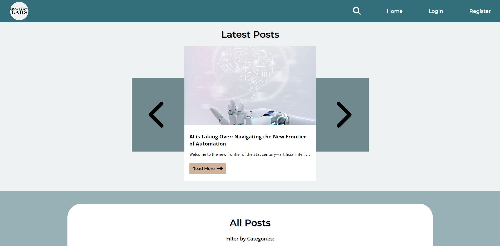

# FED1 Project Exam 1

My submission for the Front-End Developer studies Project Exam 1 at Noroff Vocational school. It demonstrates the ability to interpret a brief, plan a solution, design a user interface, and build and test a responsive web application using HTML, CSS, and JavaScript.

## Description

The goal of this website is to view dynamic blog posts display fetched from an API. There are also pages created for user registration, login, and blog post creation and management. The Admin is in charge of the blog post management. Another important aim was to create a responsive design to ensure optimal viewing on various devices.

### Client Information

Name: HotView Labs

Sector: Tech Research and Development

Size: 30 employees

Location: Worldwide

Mission: Provide the most accurate and up-to-date insights to tech leaders across the world.

## Built with

- HTML: For structuring the web pages.
- CSS: For styling the application and ensuring responsiveness.
- JavaScript: For fetching API data and adding interactive functionalities.

## Contact

[My LinkedIn Page](https://www.linkedin.com/in/regine-dille-kornbakk-aa0a7b288/)

## Website link:

https://hotviewlabs.netlify.app/